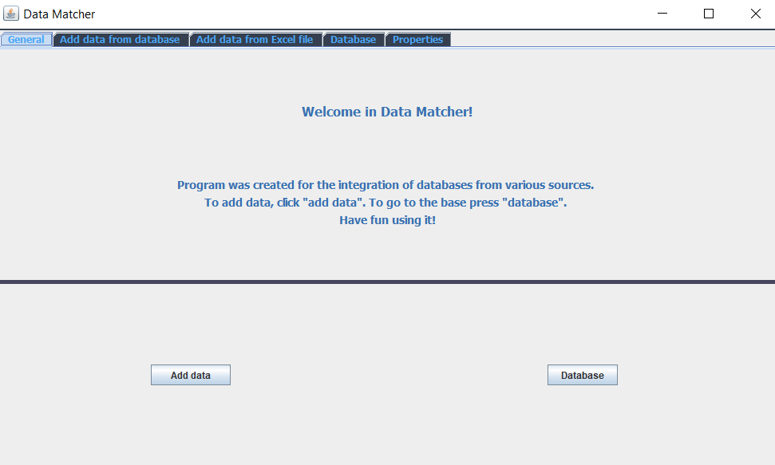
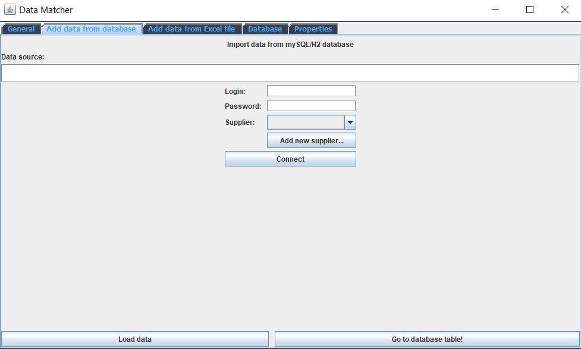
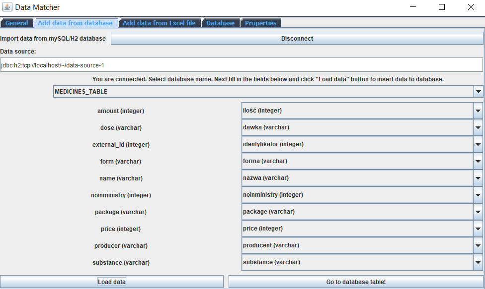
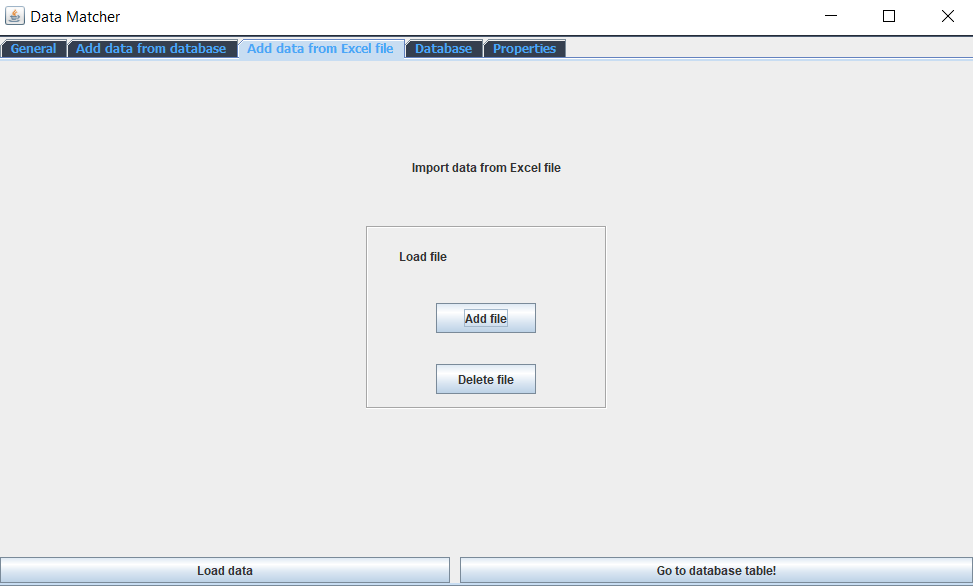
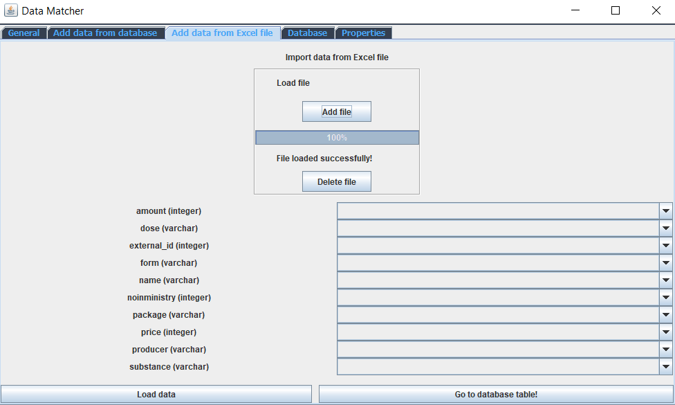
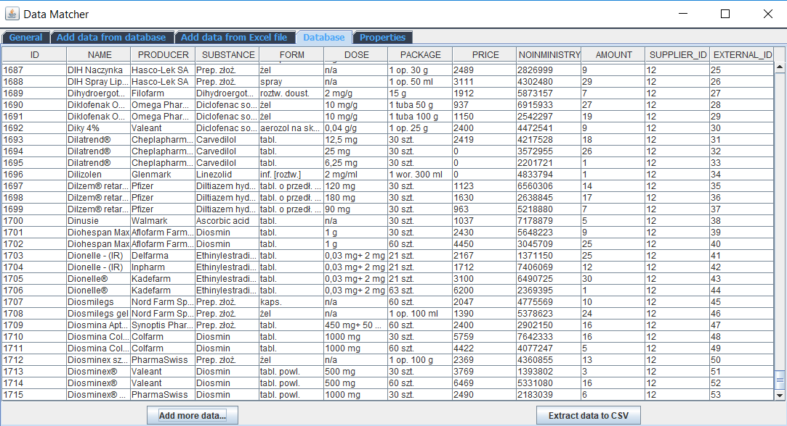

# Data Matcher
> Data matcher is a desktop program that was created to integrate databases from various sources into one universal base.
> The Data Matcher at this stage ensures the integration of such data sources as Excel, MySQL and H2. 
> Efforts have been made to make the user interface as transparent and intuitive as possible. 

## Table of contents
* [General info](#general-info)
* [Logic of adding data](#logic)
* [Screenshots](#screenshots)
* [Technologies](#technologies)
* [Features](#features)
* [Status](#status)

## General info

The application consists of a window with four tabs ("General info", "Add data from database", "Add data from Excel file", "Database" and unused yet "Properties." 
The first tab presents the most important information. There are two buttons encouraging further action - 
the first from them takes us to the "Add data from database" tab, the second one to the "Database" tab. 

After going to "Add data from database" user have to provide a link, login and password to the database, and then click the "Connect" button.
At this point the panel for selecting the base from which the user wants to download data and comboboxes appears, 
allowing to select the fields appearing in the database to be loaded and assigning them to the target base fields. 

After filling in the fields, you can load the data to our database by clicking the button "Load data to database" 
and go to the database by clicking "Go to database!"

The "Add data from Excel" tab allows you to add a file with the extension xls and xlsx. 
After adding a file, the mechanism for integrating field names and adding data is the same as for loading data from the database. 

In the "Database" tab, we can display the added records. Below the table you can find the "Extract to CSV" button 
that will allow you to save the database to a file with the extension csv

The user also has the option of deleting the file.

## Logic of adding data
By adding new data, we combine the field of the identifier from its database with the field "external_id". 
The ID in the target database is generated automatically. If the same record from the same database is repeated several times, 
its "external_id" remains unchanged, while the id changes. To differentiate the "external_id" fields from different databases, 
the supplier was added and a relationship was created with it.

## Screenshots

## Technologies
* Java version: 1.7
* Maven version: 3.6.1
* Checkstyle version: 3.0.0
* mySQL version: 8.0.16
* junit version: 4.11
* Appache Poi version: 4.1.0
* Lombok version: 1.18.6

## Features
Ready features:
* adding records from databases
* adding records from excel
* the ability to choose a table from the database you want to use
* integration of fields downloaded from the user database
* connectivity with the supplier's table
* the ability to add suppliers
* save the database to a file with the extension csv

To-do list:
* unit tests
* automation tests
* "settings" tab
* integration with PostgreSQL and Microsoft SQL Server databases
* the ability to download data from other tabs of the excel file
* the ability to filter the base

## Status
Project is: in progress

